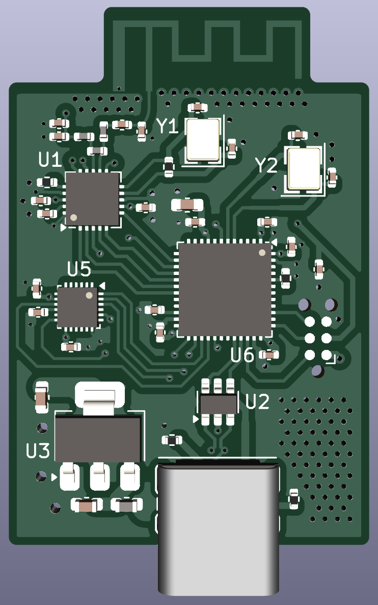

# rf-stm32-imu
4-layer (sig-gnd-gnd-sig) PCB with STM32F4, ICM20948, NRF24L01, USB-C, and 2.4GHz PCB trace antenna from TI's AN043. USB and RF traces are impedance matched/controlled to 90 ohms and 50 ohms respectively.

Antenna: https://www.ti.com/lit/an/swra117d/swra117d.pdf

  
  
  
  
  

